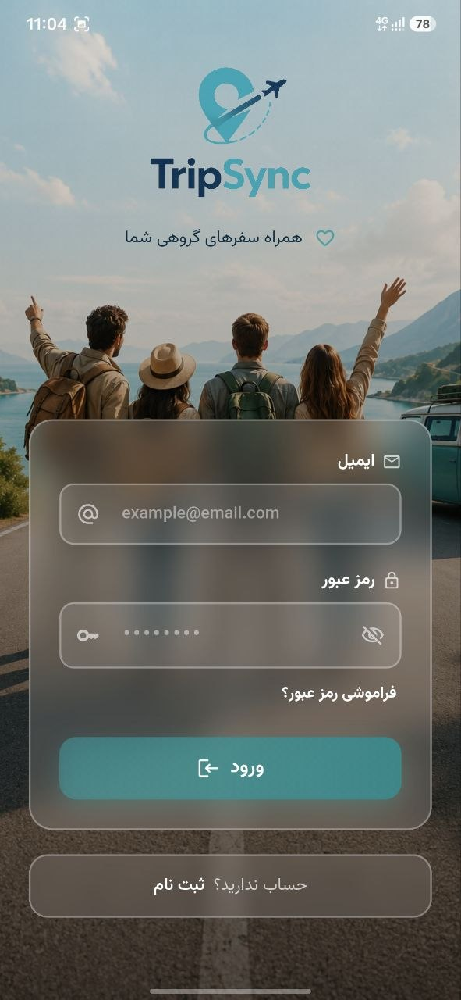
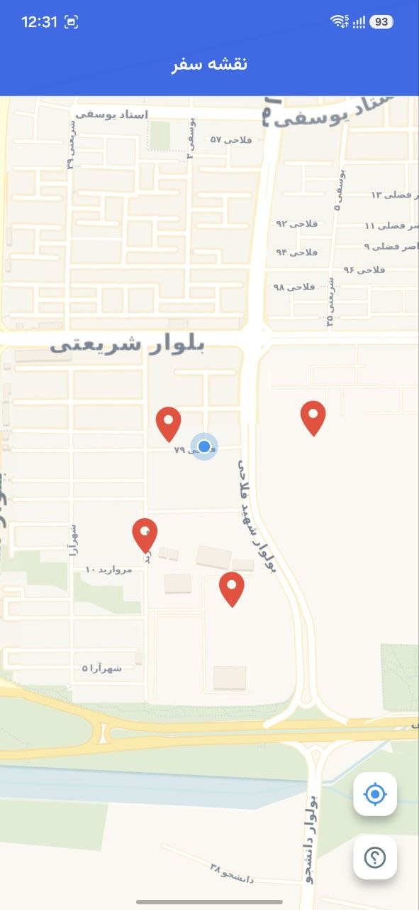

# TripSync

TripSync is a travel collaboration app built with Flutter. It helps users create trips, invite members, share locations on a map, attach media to markers, and manage trip expenses with split calculations.

## 🚀 Features

- **Auth & Profile:** Secure user authentication and profile management via Supabase.
- **Trip Management:** Create trips and join others using a unique invite code.
- **Interactive Map:** Add, edit, and view markers with support for image and audio media.
- **Expense Tracker:** Manage shared costs, set payers, and split expenses among trip members.
- **Balance Overview:** Real-time calculation of who owes whom.
- **Localization:** Integrated Persian date picker and localized UI.

## 🛠 Tech Stack

- **Framework:** Flutter 3.41.1
- **State Management:** Riverpod (AsyncNotifier & Provider Composition)
- **Routing:** GoRouter
- **Backend:** Supabase (Auth, PostgreSQL, Storage, RLS)
- **Maps:** flutter_map

## 📸 Screenshots

### Onboarding & Authentication

<table>
  <tr>
    <td></td>
    <td></td>
    <td></td>
  </tr>
</table>

### Trips & Collaboration

<table>
  <tr>
    <td></td>
    <td></td>
    <td></td>
  </tr>
  <tr>
    <td align="center"><b>Home</b></td>
    <td align="center"><b>Trip Details</b></td>
    <td align="center"><b>Join Trip</b></td>
  </tr>
</table>

### Map & Markers

<table>
  <tr>
    <td></td>
    <td></td>
    <td></td>
  </tr>
</table>

### Financial Management

<table>
  <tr>
    <td></td>
    <td></td>
    <td></td>
  </tr>
</table>

## 🏗 Project Structure

The project follows a **feature-first architecture**:

- `lib/features/trip`: Trip creation and membership logic.
- `lib/features/expenses`: Expense tracking and splitting algorithms.
- `lib/features/markers`: Map integration and media attachments.
- `lib/features/profile`: User settings and identity.
- `lib/core`: Shared utilities, themes, and network configurations.

## 🗄 Data Model

TripSync utilizes a relational schema in Supabase with the following core entities:

- `profiles`, `trips`, `trip_members`, `trip_markers`, `marker_media`, `expenses`, `expense_splits`.

Row Level Security (RLS) is implemented to ensure users only access data from trips they are members of.
